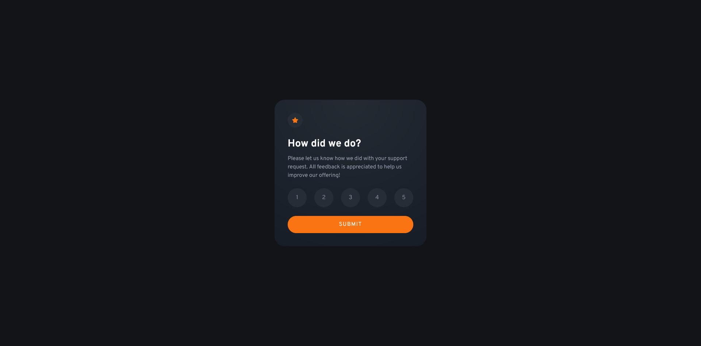

# Frontend Mentor - Interactive rating component solution

This is a solution to the [Interactive rating component challenge on Frontend Mentor](https://www.frontendmentor.io/challenges/interactive-rating-component-koxpeBUmI). Frontend Mentor challenges help you improve your coding skills by building realistic projects. 

## Table of contents

- [Overview](#overview)
  - [The challenge](#the-challenge)
  - [Screenshot](#screenshot)
  - [Links](#links)
- [My process](#my-process)
  - [Built with](#built-with)
  - [What I learned](#what-i-learned)
  - [Continued development](#continued-development)
  - [Useful resources](#useful-resources)
- [Author](#author)
- [Acknowledgments](#acknowledgments)

## Overview

### The challenge

Users should be able to:

- View the optimal layout for the app depending on their device's screen size
- See hover states for all interactive elements on the page
- Select and submit a number rating
- See the "Thank you" card state after submitting a rating

### Screenshot

### Links

- Solution URL: [GitHub](https://github.com/mbdelarosa/interactive-rating-component)
- Live Site URL: [Interactive Rating Component](https://mbdelarosa.github.io/interactive-rating-component/)

## My process

### Built with

- Semantic HTML5 markup
- CSS custom properties
- Flexbox
- CSS Grid
- Mobile-first workflow
- Javascript

### What I learned

- Use `fieldset` to group the radio buttons together
- How to style radio buttons with CSS
	- Use of `appearance: none` instead of `display: none` to hide the native radio buttons
- I was also able to reuse my learnings from the Intro Component with Signup Form challenge here, especially with using `aria-describedby` and `aria-live` properties for the error message and Thank-You display

### Continued development

Looking forward to challenges where forms also have custom styling

### Useful resources

- [Pure CSS Custom Styled Radio Buttons](https://moderncss.dev/pure-css-custom-styled-radio-buttons/) by Stephanie Eckles - This really helped explain how to style radio buttons using CSS without breaking accessibility

## Author

- Frontend Mentor - [@mbdelarosa](https://www.frontendmentor.io/profile/mbdelarosa)

## Acknowledgments

These threads from the Discord server were a big help (had similar issues and questions):
- [Radio Buttons - Style on input or label](https://discord.com/channels/824970620529279006/1113247011077116014)
- [Responsive interactive rating component using HTML, CSS and JavaScript](https://discord.com/channels/824970620529279006/1113247011077116014)
